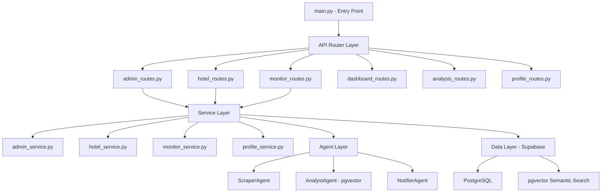

# Tripzy.travel Backend Architecture (Speed-Optimized)

The Tripzy backend is built with FastAPI and follows a 3-Layer Modular Architecture designed for scalability, AI navigability, and performance.

## 🏗️ Core Structure

### 1. The Entry Point (`main.py`)

Acts purely as the application orchestrator. Responsible for:

- Environment loading and configuration.
- Global exception handling.
- Middleware (CORS).
- Router registration.

### 2. API Routing Layer (`backend/api/`)

Endpoints are isolated into logical domains. This reduces context noise and allows for faster AI processing.

- `admin_routes.py`: System stats, user management, and global settings.
- `hotel_routes.py`: Hotel CRUD and directory search (with "Cold Start" logic).
- `monitor_routes.py`: Asynchronous price monitoring triggers and scan sessions.
- `analysis_routes.py`: Market intelligence and autonomous rival discovery.

### 3. Service Layer (`backend/services/`)

Contains the core business logic. Separation from routes ensures that logic is reusable (e.g., by both API and background cron tasks).

### 4. Autonomous Agent Mesh (`backend/agents/`)

Specialized LLM-powered agents:

- **ScraperAgent:** Multi-provider data extraction.
- **AnalystAgent:** Vector-based reasoning and parity detection.
- **NotifierAgent:** Intelligent alerting based on user preferences.

## ⚡ Speed & AI Optimization

- **Router Isolation:** Files are kept under 500 lines to ensure the AI can process them in a single pass.
- **Lazy Loading Strategy:** Heavy agents and service-role DB clients are initialized only when needed.
- **Decoupled Logic:** `main.py` size has been reduced by 95%, making IDE autocompletion and linting significantly faster.
