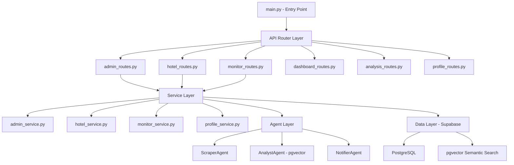
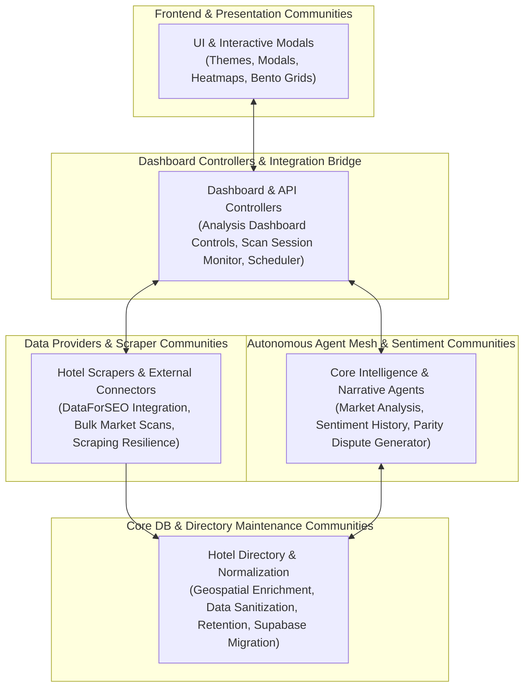

# Tripzy.travel Backend Architecture (Speed-Optimized)

The Tripzy backend is built with FastAPI and follows a 3-Layer Modular Architecture designed for scalability, AI navigability, and performance.

## 🏗️ Core Structure

```mermaid
graph TD
    A[main.py - Entry Point] --> B[API Router Layer]
    B --> B1[admin_routes.py]
    B --> B2[hotel_routes.py]
    B --> B3[monitor_routes.py]
    B --> B4[dashboard_routes.py]
    B --> B5[analysis_routes.py]
    B --> B6[profile_routes.py]

    B1 --> C[Service Layer]
    B2 --> C
    B3 --> C

    C --> C1[admin_service.py]
    C --> C2[hotel_service.py]
    C --> C3[monitor_service.py]
    C --> C4[profile_service.py]

    C --> D[Agent Layer]
    D --> D1[ScraperAgent]
    D --> D2[AnalystAgent - pgvector]
    D --> D3[NotifierAgent]

    C --> E[Data Layer - Supabase]
    E --> E1[PostgreSQL]
    E --> E2[pgvector Semantic Search]
```

### 1. The Entry Point (`main.py`)

Acts purely as the application orchestrator. Responsible for:

- Environment loading and configuration.
- Global exception handling: Scrubs all 500+ errors to prevent leakage of internal system traces.
- Middleware (Manual CORS & Security headers).
- Router registration.

### 2. API Routing Layer (`backend/api/`)

Endpoints are isolated into logical domains. This reduces context noise and allows for faster AI processing.

- `admin_routes.py`: System stats, user management, and global settings.
- `hotel_routes.py`: Hotel CRUD and directory search (with "Cold Start" logic).
- `monitor_routes.py`: Asynchronous price monitoring triggers and scan sessions.
- `analysis_routes.py`: Market intelligence and autonomous rival discovery.

### 3. Service Layer (`backend/services/`)

Contains the core business logic. Separation from routes ensures that logic is reusable (e.g., by both API and background cron tasks).

### 4. Autonomous Agent Mesh (`backend/agents/`)

Specialized LLM-powered agents:

- **ScraperAgent:** Multi-provider data extraction.
- **AnalystAgent:** Vector-based reasoning and parity detection.
- **NotifierAgent:** Intelligent alerting based on user preferences.
- **Collaborative Directory Engine:** (Part of `hotel_service.py`) Automatically indexes manually added hotels into the global hotel directory, creating a community-driven marketplace.

## 🗄️ Unified Data Strategy
The system bridges official and community data through a dual-upsert mechanism:
- **Official Data**: Uses `serp_api_id` as the primary key for Google-sourced hotels.
- **Community Data**: Uses a unique constraint on `(name, location)` for user-added properties.
- **Global Identity**: Every directory entry is assigned a `property_token` (SHA-256 hash of core identifiers) for consistent internal reference across services.

## ⚙️ Background Operations (Redis-Free)

The system maintains persistent health and data freshness through a **Lean Serverless Infrastructure**:

- **FastAPI BackgroundTasks**: All manual and asynchronous monitoring logic runs in-process. This eliminates the need for a separate Celery/Redis cluster and stays within free-tier infrastructure limits.
- **Supabase-Backed State Machine**: The `scan_sessions` table acts as the system-wide queue. Analysts and Scrapers update their "Reasoning Trace" directly in the database for real-time frontend auditing.
- **Self-Healing Scheduler**: A multi-layered trigger (Cron + GitHub Actions) ensures scans are dispatched on time. The system anchors next scan times to the database to prevent drift and executes scans directly.

## ⚡ Speed & AI Optimization

- **Router Isolation:** Files are kept under 500 lines to ensure the AI can process them in a single pass.
- **Lazy Loading Strategy:** Heavy agents and service-role DB clients are initialized only when needed.
- **Decoupled Logic:** `main.py` size has been reduced by 95%, making IDE autocompletion and linting significantly faster.

## 🤝 Component Communities & Integration Network

The codebase is highly modularized into several decoupled component communities (identified via graph-theoretic classification). The **Dashboard Controllers & Integration Bridge** acts as the central coordinator, bridging data providers with autonomous agents to deliver real-time market insights.

```mermaid
graph TD
    subgraph Frontend["Frontend & Presentation Communities"]
        UI["UI & Interactive Modals<br>(Themes, Modals, Heatmaps, Bento Grids)"]
    end

    subgraph Controllers["Dashboard Controllers & Integration Bridge"]
        DC["Dashboard & API Controllers<br>(Analysis Dashboard Controls, Scan Session Monitor, Scheduler)"]
    end

    subgraph Providers["Data Providers & Scraper Communities"]
        Scrapers["Hotel Scrapers & External Connectors<br>(DataForSEO Integration, Bulk Market Scans, Scraping Resilience)"]
    end

    subgraph AI["Autonomous Agent Mesh & Sentiment Communities"]
        Agents["Core Intelligence & Narrative Agents<br>(Market Analysis, Sentiment History, Parity Dispute Generator)"]
    end

    subgraph Directory["Core DB & Directory Maintenance Communities"]
        DS["Hotel Directory & Normalization<br>(Geospatial Enrichment, Data Sanitization, Retention, Supabase Migration)"]
    end

    UI <--> DC
    DC <--> Scrapers
    DC <--> Agents
    Scrapers --> DS
    Agents <--> DS
```

### Key Community Interactions:
1. **Interactive UI Presentation**: The Frontend community accesses aggregated data streams and triggers manual/automated scans via the **Dashboard Controllers & Integration Bridge**.
2. **Scraper Orchestration**: Scraper communities (incorporating DataForSEO and Firecrawl scraper integrations) are orchestrated by the controllers to retrieve and sanitize hotel rate catalogs, writing results directly to the **Directory & Database Maintenance** layer.
3. **Autonomous Reasoning**: The autonomous agents (using vector databases and pgvector) query hotel directory records to analyze parity violations and feed narrative reports back through the controllers to the interactive frontend.
