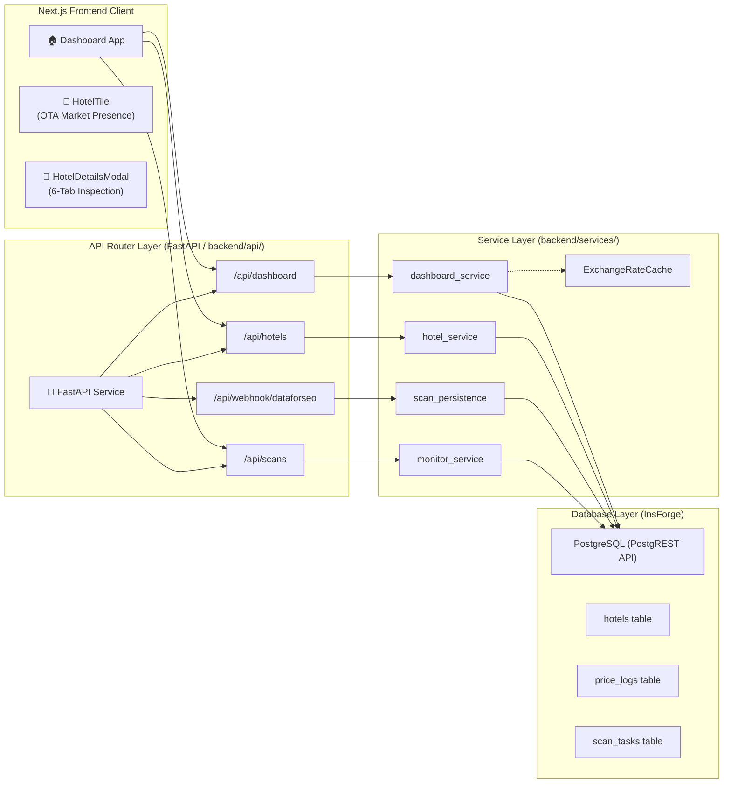
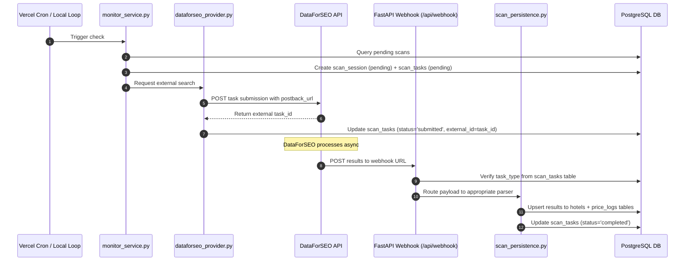
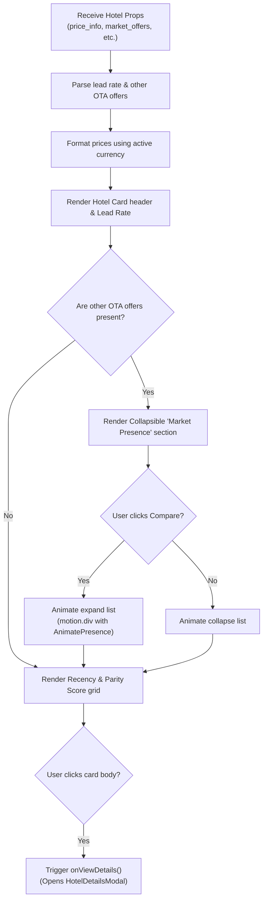
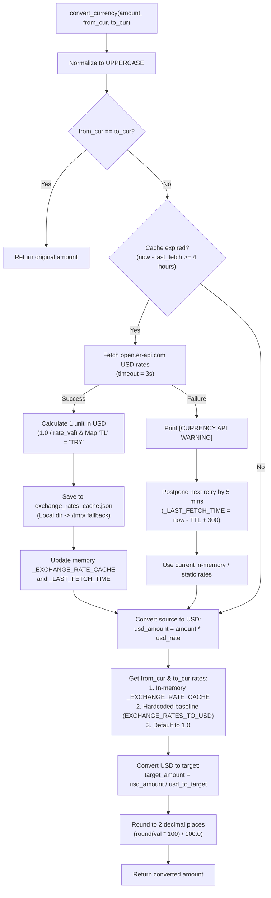

# Project Architecture: HotelPlus (Tripzy) 🏨🚀

> [!IMPORTANT]
> **PRIMARY SOURCE OF TRUTH**: This document is the authoritative record of the HotelPlus platform. Every agent, service, and database table MUST be documented here. Reference this file FIRST when starting any task.

## 🕒 Recent Updates (May 9, 2026)
- ✅ **Type Safety (Pyright/Pylance lints)**: Resolved 1000+ static-analysis false positives related to `Sequence[JSON]` subscript access on raw InsForge `execute().data` payloads in the admin service (`scan_admin.py`). Used `typing.cast()` to ensure strict static type safety without impacting runtime behavior.

## 🕒 Recent Updates (May 6, 2026)
- ✅ **Vector Competitor Match Target City Fallback Bugfix**: Resolved a semantic leakage bug in `AnalystAgent.discover_rivals` where omitting the `target_city` argument caused the `match_hotels` RPC fallback match to run without any city filter (resulting in hotels from different cities missing coordinates).
- ✅ **Syntax Verification**: Completed dynamic compilation testing on all modified backend python files.

## 🕒 Recent Updates (May 5, 2026)
- ✅ **Retention Aggregation Fix (Rank 1)**: Corrected the SQL jsonb aggregation in `perform_data_maintenance()` (defined in Migration 039) to verify that `room_types` is a JSON array before invoking `jsonb_array_length()`. Prevents terminal transaction aborts caused by corrupted or non-array records, securing robust `price_history_daily` rollup generation.
- ✅ **PEP-8 Multi-line Conditional Expansion (Rank 3)**: Refactored ten inline single-line conditional statements in `dashboard_service.py` and `scan_persistence.py` into compliant multi-line blocks. Drastically improves debugger step-through ergonomics and provides accurate line-by-line coverage analysis.
- ✅ **Ruff Linting & Syntax Alignment**: Validated all code changes via Ruff, ensuring perfect syntax and indentation.
- ✅ **Regression-Free Verification**: Executed extensive backend integration suites (`integration_test_dashboard.py` and `test_dataforseo_normalization.py`) verifying that the refactored code correctly maps hotels, performs exchange rate calculations, computes historical trend lines, and processes DataForSEO pricing feeds without regression.

## 🕒 Recent Updates (May 4, 2026)
> [!CAUTION]
> **PENDING VERIFICATION**: The following updates were added by Antigravity and require verification by Claude for technical accuracy and alignment with the latest codebase.

- ✅ **Migration 040**: Added `source`, `url`, `capacity`, and `image_url` to `room_type_catalog` to fix PGRST204 mismatch.
- ✅ **Exchange Rate Cache Subsystem**: Implemented a dynamic, dual-layer persistent exchange rates caching mechanism:
  - **Dynamic In-Memory & Static Baseline Fallbacks**: Uses a memory-resident `_EXCHANGE_RATE_CACHE` initialized from local disk cache, backed by a hardcoded static baseline (`USD: 1.0`, `EUR: 1.08`, `GBP: 1.26`, `TRY`/`TL: 0.029`) for ultimate fail-safe security.
  - **Dual-Path Disk Persistence**: Automatically serializes rate JSON mappings to local file `exchange_rates_cache.json` in `backend/utils/` or `/tmp/exchange_rates_cache.json` to handle write-permission issues dynamically.
  - **Live Dynamic Updates & TTL**: Fetches live exchange data from `https://open.er-api.com/v6/latest/USD` using a 4-hour (14,400 seconds) cache TTL with a 3-second request timeout.
  - **API Error Resilience & Retry Backoff**: Gracefully handles network or API outages by outputting a warning `[CURRENCY API WARNING]`, reusing previous cached rates, and adding a 5-minute backoff delay to prevent request flooding.
  - **Conversion Logic**: Normalizes inputs to UPPERCASE, resolves `TL` as an alias for `TRY`, processes conversions via USD intermediate rates, and rounds results to 2 decimals (`round(val * 100) / 100.0`) to prevent floating-point inaccuracies.
- ✅ **Pricing DNA**: Integrated Gemini 3 for automated strategy synthesis (Volume Leader vs Yield Seeker).
- ✅ **Parallel Scans**: Enhanced DataForSEO provider to use `asyncio.gather` for concurrent hotel data retrieval.
- ✅ **Discovery Engine**: Deployed HNSW-indexed vector search for semantic competitor matchmaking.

## 1. System Overview
8. [Key Data Flows](#8-key-data-flows)
9. [Known Bugs & Fixes Log](#9-known-bugs--fixes-log)
10. [Environment & Configuration](#10-environment--configuration)
11. [Deployment](#11-deployment)
12. [Common Debugging Patterns](#12-common-debugging-patterns)

---

## 1. System Overview

HotelPlus is a **hotel market intelligence and autonomous rate parity discovery platform**. It monitors hotel prices across OTAs (Online Travel Agencies), detects parity violations, analyzes guest sentiment, and generates strategic narratives.

### Core Capabilities
- **Rate Parity Monitoring**: Compares direct hotel rates against Booking.com, Expedia, TripAdvisor, Trip.com etc.
- **DataForSEO Integration**: Automated scan pipeline for price data and hotel info collection.
- **Sentiment Analysis**: Aggregates and themes guest reviews across platforms.
- **Parity Alerts**: Notifies when OTA rates undercut the hotel's own direct rate.
- **Multi-Hotel Dashboard**: Single view for target hotel + competitors.

### Architectural Diagram


---

## 2. Tech Stack

| Layer | Technology | Version | Notes |
|---|---|---|---|
| Frontend Framework | Next.js | `15.1.11` | **DO NOT UPGRADE** — locked for InsForge middleware stability |
| UI Library | React | `19.0.x` | Stable concurrent features |
| Styling | Tailwind CSS | `3.4.14` | **DO NOT UPGRADE TO v4** — standard directives only |
| Database | PostgreSQL (InsForge) | Latest | PostgREST API access |
| Backend Framework | FastAPI | Latest stable | Python async backend |
| Python Runtime | Python 3.11+ | — | Uses `.venv` — never install global packages |
| OTA Data Provider | DataForSEO API | — | Price search + hotel_info scan types |
| AI/LLM | Google Gemini | — | Narrative generation, sentiment, agents |
| Hosting | Vercel (frontend) | — | Production deployments |
| Backend Hosting | InsForge (BaaS) | — | DB, Auth, Storage, Functions |

---

## 3. Directory Structure

```
hotel/
├── app/                          # Next.js App Router pages
│   ├── (dashboard)/              # Main dashboard views
│   │   ├── page.tsx              # /dashboard — main view
│   │   ├── analytics/            # Trend & analytics pages
│   │   └── parity/               # Parity monitor page
│   ├── api/                      # Next.js API routes (proxies to FastAPI)
│   │   ├── cron/                 # Vercel Cron trigger endpoint
│   │   ├── dashboard/            # Dashboard data endpoint
│   │   └── webhook/              # DataForSEO postback handler
│   └── layout.tsx
├── backend/
│   ├── api/                      # FastAPI route definitions (domain-isolated)
│   │   ├── dashboard.py          # GET /api/dashboard/{user_id}
│   │   ├── hotels.py             # Hotel CRUD
│   │   ├── scans.py              # Scan triggers & status
│   │   └── webhook.py            # POST /api/webhook/dataforseo
│   ├── agents/                   # Specialized LLM agents
│   │   ├── scraping_agent.py     # DataForSEO result parsing
│   │   └── narrative_agent.py    # Synthetic narrative generation
│   ├── services/                 # Pure business logic
│   │   ├── dashboard_service.py  # *** Main dashboard assembly logic ***
│   │   ├── hotel_service.py      # Hotel CRUD + metadata enrichment
│   │   ├── scan_persistence.py   # *** Writes scan results to DB ***
│   │   ├── monitor_service.py    # Scan scheduling & recovery
│   │   ├── analysis_service.py   # Sentiment & parity analysis
│   │   ├── alert_service.py      # Parity alert generation
│   │   └── providers/
│   │       └── dataforseo_provider.py  # *** DataForSEO API integration ***
│   ├── scripts/
│   │   └── continuous_monitor.py # Local dev scan loop (NOT production)
│   └── migrations/               # SQL migration files (numbered)
│       └── insforge_schema_rebuild.sql  # Full schema reference
├── components/
│   ├── modals/
│   │   └── HotelDetailsModal.tsx # *** Hotel detail popup (currency + reviews) ***
│   ├── analytics/                # Recharts chart components
│   └── ui/                       # Shared UI primitives
├── types/
│   └── index.ts                  # TypeScript type definitions
├── lib/
│   ├── utils.ts                  # parsePrice, cn, formatters
│   └── i18n.ts                   # Translation hook
└── public/
```

---

## 4. Database Schema

### Core Tables

#### `hotels`
The master hotel record. Updated on every `hotel_info` scan.
```sql
id                  UUID PRIMARY KEY
name                TEXT
serp_api_id         TEXT UNIQUE        -- DataForSEO hotel token
property_token      TEXT               -- Legacy token field
currency            TEXT               -- *** AUTHORITATIVE currency field ***
rating              NUMERIC
review_count        INTEGER
stars               INTEGER
image_url           TEXT
latitude            NUMERIC
longitude           NUMERIC
address             TEXT
location            TEXT
amenities           JSONB              -- Array of amenity strings
images              JSONB              -- Array of {original, thumbnail} objects
reviews             JSONB              -- Nested object (legacy, see other_sites_reviews)
other_sites_reviews JSONB              -- Array: [{title, url, rating:{value,rating_max,...}, review_text}]
market_offers       JSONB              -- OTA price offers from hotel_info scan
parity_offers       JSONB              -- Subset of market_offers flagged for parity
offers              JSONB              -- Generic offers
room_types          JSONB              -- Array: [{name, price, currency, source}]
sentiment_breakdown JSONB              -- Array of sentiment pillars
guest_mentions      JSONB
deleted_at          TIMESTAMP          -- Soft delete
created_at          TIMESTAMP
updated_at          TIMESTAMP
```

**Critical note**: `currency` is the DB-authoritative currency. The frontend must use this as fallback when `price_info.currency` is absent.

#### `user_hotels`
Join table linking users to hotels with preferences.
```sql
id                  UUID PRIMARY KEY
user_id             UUID               -- FK to auth.users
hotel_id            UUID               -- FK to hotels
is_target           BOOLEAN            -- TRUE = the user's own hotel
is_monitored        BOOLEAN
preferred_currency  TEXT               -- User preference OVERRIDE (may differ from hotels.currency)
fixed_check_in      DATE
fixed_check_out     DATE
default_adults      INTEGER DEFAULT 2
pricing_dna         JSONB
```

**Critical note**: `preferred_currency` here is a USER preference, not the hotel's actual currency. The fallback priority chain is:
`price_info.currency > hotels.currency > user_hotels.preferred_currency > "TRY"`

#### `price_logs`
Every price scan result. This is the time-series price table.
```sql
id              UUID PRIMARY KEY
hotel_id        UUID               -- FK to hotels
price           NUMERIC
currency        TEXT
room_types      JSONB
offers          JSONB
parity_offers   JSONB
market_offers   JSONB
ota_prices      JSONB
check_in_date   DATE
recorded_at     TIMESTAMP
scan_session_id UUID               -- FK to scan_sessions
```

#### `scan_sessions`
Groups a batch of scans for a user.
```sql
id                  UUID PRIMARY KEY
user_id             UUID
hotel_id            UUID
status              TEXT    -- 'pending' | 'running' | 'completed' | 'failed'
target_parameters   JSONB   -- {check_in, check_out, adults, hotel_name}
adults              INTEGER
check_out_date      DATE
created_at          TIMESTAMP
completed_at        TIMESTAMP
```

#### `scan_tasks`
Individual DataForSEO API tasks. One session has many tasks.
```sql
id              UUID PRIMARY KEY
session_id      UUID
hotel_id        UUID
task_type       TEXT    -- 'price_search' | 'hotel_info'
status          TEXT    -- 'pending' | 'submitted' | 'completed' | 'failed'
external_id     TEXT    -- DataForSEO task ID
result_data     JSONB   -- Raw API response
created_at      TIMESTAMP
updated_at      TIMESTAMP
```

#### `room_type_catalog`
Canonical room type records per hotel/source.
```sql
id          UUID PRIMARY KEY
hotel_id    UUID
name        TEXT
source      TEXT        -- *** Added in migration 040 ***
url         TEXT        -- *** Added in migration 040 ***
capacity    INTEGER     -- *** Added in migration 040 ***
image_url   TEXT        -- *** Added in migration 040 ***
created_at  TIMESTAMP
updated_at  TIMESTAMP
```

#### `hotel_directory`
Global shared hotel metadata (cross-user enrichment cache).
```sql
id              UUID PRIMARY KEY
serp_api_id     TEXT UNIQUE
name            TEXT
rating          NUMERIC
review_count    INTEGER
sentiment_breakdown JSONB
images          JSONB
...             -- mirrors hotels table for shared enrichment
```

#### `hotel_reviews`
Granular per-review records (separate from the JSONB snapshot in `hotels`).
```sql
id              UUID PRIMARY KEY
hotel_id        UUID
source          TEXT    -- 'tripadvisor' | 'booking' | 'google' | etc.
rating          NUMERIC
review_text     TEXT
review_date     DATE
created_at      TIMESTAMP
```

#### `alerts`
Parity breach and price change alerts.
```sql
id              UUID PRIMARY KEY
user_id         UUID
hotel_id        UUID
message         TEXT
old_price       NUMERIC
new_price       NUMERIC
is_read         BOOLEAN DEFAULT FALSE
is_global_pulse BOOLEAN DEFAULT FALSE  -- TRUE = anonymous Global Pulse win
created_at      TIMESTAMP
```

---

## 5. Backend Architecture

### 3-Layer Architecture

```
HTTP Request
     ↓
[Next.js API Route]  (/app/api/*)
     ↓ (internal fetch, proxied via next.config.ts rewrites)
[FastAPI Router]     (/backend/api/*.py)
     ↓
[Service Layer]      (/backend/services/*.py)
     ↓
[InsForge DB Client] (postgrest-py)
```

### Key Services

#### `dashboard_service.py` — Critical Service
Assembles the entire dashboard payload. Called by `/api/dashboard/{user_id}`.

**Phase 1** (parallel, asyncio.gather):
- Fetches profile, settings, alerts, searches, sessions, active scans, hotels

**Hotel fetch query** (in `_fetch_user_hotels`):
```python
db.table("user_hotels")
  .select("*, hotel:hotels(id, name, currency, room_types, stars, rating, review_count, "
          "image_url, latitude, longitude, amenities, images, reviews, other_sites_reviews, "
          "guest_mentions, sentiment_breakdown, serp_api_id, property_token, deleted_at, address, location, "
          "market_offers, parity_offers, offers)")
  .eq("user_id", uid)
```

**Phase 2** (after hotel IDs known):
- Batch price fetch via RPC `get_batch_hotel_prices`
- Directory enrichment via `hotel_directory`
- Sentiment recovery fallback

**Enrichment loop** (per hotel):
1. Merge `dir_data` (directory) → `h` (user hotel) — user data wins
2. Extract `other_sites_reviews` from `h.other_sites_reviews` OR `reviews.other_sites_reviews`
3. Build `price_info` from `price_logs` or fallback to `hotels` table fields
4. Calculate `parity_score`
5. Calculate `overall_sentiment_score`

#### `scan_persistence.py` — Write Path
Called after DataForSEO tasks complete. Writes to `hotels`, `price_logs`, `scan_tasks`.

Key function: `persist_hotel_info_result()`
- Extracts `other_sites_reviews` from `hotel_info` response
- Saves as JSONB array to `hotels.other_sites_reviews`
- Also saves `market_offers` for OTA comparison

#### `dataforseo_provider.py` — API Integration
Two task types:

| Type | DataForSEO Endpoint | Trigger | Persists To |
|---|---|---|---|
| `price_search` | `/hotels/search/task_post` | Scheduled (hourly) | `price_logs` |
| `hotel_info` | `/hotels/info/task_post` | Scheduled (daily or on-demand) | `hotels.*` |

**🚀 Optimization: Parallel Scans**
The provider utilizes `asyncio.gather` to trigger multiple hotel scans concurrently. This reduces total session initialization time from O(n) to O(1) latency relative to the number of hotels.

**🛡️ Market Selection Reliability**
To ensure data accuracy in competitive markets, the ingestion pipeline implements:
- **Deep Key Mapping**: Scans multiple SerpApi JSON keys (`rate_per_night`, `price`, `total_rate`) to prevent market depth restriction.
- **Absolute Minimum Selection**: Ignores sponsored "top-level" prices if a lower vendor rate is found in the competitive set.
- **Quota Resilience**: Differentiates between `429` (Rate Limit) and `403` (Quota Out) to maintain scan continuity across large hotel sets.

**Webhook routing**: Results arrive at `/api/webhook/dataforseo`. The webhook handler reads `task_type` from `scan_tasks` and routes to the correct parser.

---

## 6. DataForSEO Scan Pipeline

### Flow Diagram


### Recovery Path
If webhook is not received within timeout:
```
monitor_service.py recovery loop
  → finds scan_tasks with status='submitted' and age > threshold
  → calls dataforseo_provider.get_task_result(external_id)
  → manually routes to persistence
```

### Key Bug History (see §9 for full details)
- Race conditions from multiple `continuous_monitor.py` processes → run ONE process only
- "Shape B" parsing: `hotel_info` responses sometimes lack `items` → guard with `if not items: return`
- Blind webhook routing: must read `task_type` from DB, not guess from payload
- Index misalignment in monitor_service: off-by-one when slicing hotel batches
- `postback_url` rejection: DataForSEO validates the URL — use a publicly accessible URL in prod

---

## 7. Frontend Architecture

### State Management
- **React Query** (`@tanstack/react-query`) — server state, dashboard data fetching
- **Zustand** (if present) — local UI state
- **No Redux** — prefer co-located state

### Key Components

#### `HotelTile.tsx` (Hotel Card with OTA Market Presence)
The core visual component representing a single hotel on the dashboard. It features a collapsible **OTA Market Presence** comparison interface.

- **Lead Rate Display**: Shows the lowest rate available (lead price), formatted to the active currency, along with the corresponding vendor.
- **Dynamic Collapsible Section**: When multiple OTA offers are available for a hotel (retrieved via `hotel_info` scans), users can expand a list showing a side-by-side rate comparison.
- **Micro-Animations**: Uses Framer Motion's `<AnimatePresence>` and `<motion.div>` for smooth hover effects, expanded state transitions, and responsive comparison cards.
- **Direct Link / Detail Trigger**: Clicking on the card opens `HotelDetailsModal` for multi-tab granular insights.

##### Component Render & Interaction Flow:


#### `HotelDetailsModal.tsx`
The hotel detail popup. Contains 6 tabs: Overview, Gallery, Amenities, Offers, Rooms, Reviews.

**Currency resolution order** (correct after Bug Fix #7):
```typescript
const displayCurrency = 
  hotel?.price_info?.currency  // From latest price_log
  || hotel?.currency           // DB column on hotels table (authoritative)
  || hotel?.preferred_currency // User preference from user_hotels
  || "TRY";                    // Final default
```

**Reviews tab**: Reads `hotel.other_sites_reviews` (array). Shows empty state if no data collected yet. The backend normalizes the nested `rating: {value, rating_max}` structure at `dashboard_service.py:602-604` and the frontend normalizes it again at lines 77-82 of the modal.

**Review data structure** (from DataForSEO):
```json
{
  "title": "Tripadvisor",
  "url": "https://...",
  "rating": {
    "value": 4.3,
    "rating_max": null,
    "rating_type": "Max5",
    "votes_count": 78
  },
  "review_text": "..."
}
```
`rating_max: null` = Max5 scale. `rating_max: 10` = Booking.com 1-10 scale.

#### `dashboard_service.py` → Frontend type
The `HotelWithPrice` interface (in `types/index.ts`) extends `Hotel`. Key fields used by dashboard:
```typescript
interface Hotel {
  currency: string;          // From hotels.currency DB column
  other_sites_reviews?: ...  // Array of platform reviews
  price_info?: PriceInfo;    // Assembled by dashboard_service
}
interface HotelWithPrice extends Hotel {
  preferred_currency?: string;  // From user_hotels.preferred_currency
  price_info: PriceInfo;
}
```

---

## 8. Key Data Flows

### Flow 1: Dashboard Load
```
User opens /dashboard
  → React Query calls GET /api/dashboard/{user_id}
  → Next.js API Route proxies to FastAPI
  → dashboard_service.get_dashboard_logic() runs
  → Returns {target_hotel, competitors, price_info, other_sites_reviews, ...}
  → Dashboard renders HotelCard components
  → User clicks hotel → HotelDetailsModal opens with hotel data
```

### Flow 2: Scan → DB → Frontend
```
Cron triggers scan
  → scan_session created (status='pending')
  → scan_tasks created per hotel per task_type
  → DataForSEO API called → external_id stored
  → DataForSEO POSTs to webhook
  → scan_persistence writes:
      price_search → price_logs
      hotel_info → hotels (currency, other_sites_reviews, market_offers, room_types)
  → Next dashboard load picks up fresh data
```

### Flow 3: Currency Display
```
price_log.currency (from scan, e.g. "TRY")
  → dashboard_service wraps in price_info.currency
  → HotelDetailsModal reads hotel.price_info.currency
  → Fallback: hotel.currency (hotels table)
  → Fallback: hotel.preferred_currency (user preference)
  → Fallback: "TRY"
```

### Flow 4: Currency Conversion & Persistent Cache Pipeline



---

## 9. Known Bugs & Fixes Log

### Bug #1 — Race Condition (Multiple Monitor Processes)
**Date**: 2026-05-04  
**Symptom**: Duplicate scan tasks, API quota exhaustion  
**Root Cause**: Multiple `continuous_monitor.py` processes running simultaneously  
**Fix**: Kill all but one process. Never run more than 1 instance locally.

### Bug #2 — "Shape B" Parsing Error
**Date**: 2026-05-04  
**File**: `backend/services/providers/dataforseo_provider.py`  
**Symptom**: `TypeError` when `hotel_info` response has no `items` key  
**Root Cause**: DataForSEO sometimes returns `{"result": [{"hotel_info": {}}]}` without an `items` array  
**Fix**: Guard `if not items: return None` before iterating

### Bug #3 — Blind Webhook Routing
**Date**: 2026-05-04  
**File**: `backend/api/webhook.py`  
**Symptom**: `price_search` results being parsed as `hotel_info`  
**Root Cause**: Webhook tried to infer task type from payload structure instead of reading from DB  
**Fix**: Look up `scan_tasks.task_type` by `external_id` before routing

### Bug #4 — Index Misalignment in Monitor Service
**Date**: 2026-05-04  
**File**: `backend/services/monitor_service.py`  
**Symptom**: First hotel in batch always skipped  
**Root Cause**: Off-by-one slicing when batching hotel IDs  
**Fix**: Corrected slice indices

### Bug #5 — Postback URL Rejection
**Date**: 2026-05-04  
**Symptom**: DataForSEO returns error: "postback_url is invalid"  
**Root Cause**: Localhost URL used in production; DataForSEO validates URL is publicly reachable  
**Fix**: Use the Vercel deployment URL for `DATAFORSEO_POSTBACK_URL` in prod

### Bug #6 — `room_type_catalog` PGRST204 Column Mismatch
**Date**: 2026-05-04  
**File**: `backend/migrations/insforge_schema_rebuild.sql`, `040_room_catalog_add_columns.sql`  
**Symptom**: `PGRST204` — column `source` (or `url`, `capacity`, `image_url`) of table `room_type_catalog` does not exist  
**Root Cause**: Schema rebuild SQL was missing 4 columns that `scan_persistence.py` was writing to  
**Fix**: Added `source TEXT`, `url TEXT`, `capacity INTEGER`, `image_url TEXT` to both the rebuild SQL and a new migration `040_room_catalog_add_columns.sql`

### Bug #7 — Currency Displays as USD (Wrong Fallback)
**Date**: 2026-05-04  
**File**: `components/modals/HotelDetailsModal.tsx`  
**Symptom**: Prices displayed in USD when hotel's actual currency is TRY  
**Root Cause**: Fallback chain was `price_info.currency || "USD"` — missing `hotel.currency` (DB column)  
**Fix**: Changed fallback to `price_info.currency || hotel.currency || preferred_currency || "TRY"` in 3 places (lines 259, 445, 493)

### Bug #8 — Reviews Tab Appears Empty (Data Not Yet Collected)
**Date**: 2026-05-04  
**Status**: NOT a code bug — data issue  
**Symptom**: Reviews tab shows "No Source Reviews Yet" for most hotels  
**Root Cause**: Only hotels that have completed a `hotel_info` scan will have `other_sites_reviews` populated. Most hotels in the system haven't had a `hotel_info` scan yet.  
**Resolution**: Run `hotel_info` scans for target hotels. The data pipeline is correct; only collection is pending.  
**Verification**: `SELECT id, name, jsonb_array_length(other_sites_reviews) FROM hotels WHERE other_sites_reviews IS NOT NULL;`

### Bug #9 — Retention Flow Inconsistency (Rank 1 Technical Debt)
**Date**: 2026-05-05  
**File**: `backend/migrations/039_fix_retention_logic.sql`  
**Symptom**: `price_history_daily` records intermittently missing or fail to generate, resulting in gaps/missing daily analytics historical trends.  
**Root Cause**: When aggregating `room_types` with `jsonb_agg()`, the ordering parameter `jsonb_array_length(room_types)` would throw a PG database exception (`jsonb value must be an array`) if any row's `room_types` was not a JSON array (e.g. `NULL` or simple strings). The single-transaction wrapped block would abort the entire day's rollup silently.  
**Fix**: Updated the aggregation to verify that `room_types` is indeed a JSON array using `jsonb_typeof()` before reading its length:
```sql
(jsonb_agg(room_types ORDER BY CASE WHEN jsonb_typeof(room_types) = 'array' THEN jsonb_array_length(room_types) ELSE 0 END DESC) -> 0) as room_type_summary
```

### Bug #11 — Semantic Leakage in Competitor Discovery Fallback
**Date**: 2026-05-06  
**File**: `backend/agents/analyst_agent.py`  
**Symptom**: Hotels from completely different cities matched as close competitors during ghost discovery when coordinates were missing.  
**Root Cause**: The `match_hotels` RPC defines a fallback matching condition: `target_city IS NULL OR h.location ILIKE '%' || target_city || '%'`. Because `target_city` was completely omitted from the RPC call arguments within the Python agent layer, it defaulted to `NULL`, rendering the city match condition universally true.  
**Fix**: Extracted the target hotel's city from `resolved_location_name` or `location` within `discover_rivals` and passed `"target_city": target_city` in the `match_hotels` RPC.

---

## 10. Current Technical Debt & Challenges

> [!WARNING]
> **ACTIVE BLOCKERS**: These issues are tracked for resolution and should be considered when modifying related components.

### 1. Broad Exception Handling
- **Issue**: Several services (notably `admin_service.py`) use broad `except Exception:` blocks.
- **Impact**: Masks specific errors, making debugging difficult.
- **Action**: Refactor to catch specific `PostgrestError` or `HTTPException`.

### 2. Vector Dimensionality Workaround
- **Issue**: `gemini-embedding-001` returns 3072 dims, but DB is `vector(768)`.
- **Status**: Currently using **Slicing** (taking first 768 elements).
- **Long-term**: Consider re-indexing DB to 3072 if semantic precision loss is detected in Discovery Engine.

---

## 11. Environment & Configuration

### Required Environment Variables

| Variable | Where Used | Notes |
|---|---|---|
| `DATAFORSEO_LOGIN` | `dataforseo_provider.py` | DataForSEO account email |
| `DATAFORSEO_PASSWORD` | `dataforseo_provider.py` | DataForSEO account password |
| `DATAFORSEO_POSTBACK_URL` | Scan task creation | Must be publicly accessible URL ending in `/api/webhook/dataforseo` |
| `INSFORGE_URL` | DB client | Backend base URL |
| `INSFORGE_KEY` | DB client | Service role key (backend only) |
| `NEXT_PUBLIC_INSFORGE_URL` | Frontend SDK | Same URL, exposed to browser |
| `NEXT_PUBLIC_INSFORGE_ANON_KEY` | Frontend SDK | Anonymous key for client auth |
| `GOOGLE_API_KEY` | Gemini agent | For narrative generation |

### Currency Configuration
- **Hotel-level**: `hotels.currency` column (set during scan, e.g. `"TRY"`)
- **User-level**: `user_hotels.preferred_currency` (user override)
- **Display-level**: `user_settings.currency` (dashboard-wide display currency, used for conversion)
- **Conversion**: `dashboard_service.convert_currency()` converts all prices to `display_currency`

### DataForSEO Task Types
- `price_search`: Cheaper, returns current prices. Triggered hourly. Does NOT return OTA breakdown.
- `hotel_info`: More expensive, returns full OTA breakdown + reviews + room types. Triggered daily/on-demand.

---

## 11. Deployment

### Production
- **Frontend**: Vercel (auto-deploy on push to `main`)
- **Backend**: InsForge edge functions / FastAPI (deployed separately)
- **Cron**: Vercel Cron triggers `/api/cron` endpoint
- **Webhook**: DataForSEO POSTs to `https://<vercel-domain>/api/webhook/dataforseo`

### Local Development
```bash
# Frontend
npm run dev

# Backend (SINGLE PROCESS ONLY)
cd backend
source .venv/bin/activate
python scripts/continuous_monitor.py

# NEVER run multiple monitor processes simultaneously
```

### Database Migrations
Migration files in `backend/migrations/`. Apply sequentially:
```sql
-- Example: applying migration 040
-- Run via InsForge run-raw-sql MCP tool or psql
```
The `insforge_schema_rebuild.sql` is the canonical full schema for fresh rebuilds.

---

## 12. Common Debugging Patterns

### "Dashboard shows old data / no price"
1. Check `price_logs` has recent entries for the hotel: `SELECT * FROM price_logs WHERE hotel_id = '...' ORDER BY recorded_at DESC LIMIT 5;`
2. Check scan_tasks status: `SELECT status, task_type, updated_at FROM scan_tasks WHERE hotel_id = '...' ORDER BY updated_at DESC LIMIT 10;`
3. Check if scan_session is stuck: `SELECT * FROM scan_sessions WHERE status IN ('pending', 'running') ORDER BY created_at DESC;`

### "Reviews tab is empty"
1. Check if `other_sites_reviews` is populated: `SELECT name, jsonb_array_length(other_sites_reviews) FROM hotels WHERE id = '...';`
2. If 0 or null → trigger a `hotel_info` scan for this hotel
3. If populated → check frontend console for JS errors in the modal

### "Currency shows wrong"
1. Verify `hotels.currency` column is set: `SELECT id, name, currency FROM hotels WHERE id = '...';`
2. If null → `hotel_info` scan hasn't run yet or provider didn't parse currency
3. If set → check `dashboard_service.py` enrichment loop isn't overwriting with wrong value

### "Parity score is always 100%"
1. Check if `price_info.offers` array is non-empty for the hotel
2. Check if `room_type_standard` is set to a standard-type key (not "Suite")
3. Verify OTA prices are being converted to the same `display_currency`

### "PGRST204 error on scan"
1. Column exists in `scan_persistence.py` INSERT but not in DB schema
2. Run: `SELECT column_name FROM information_schema.columns WHERE table_name = 'room_type_catalog';`
3. Add missing column via migration and update `insforge_schema_rebuild.sql`

### "DataForSEO webhook not firing"
1. Verify `DATAFORSEO_POSTBACK_URL` is a public URL (not localhost)
2. Check DataForSEO task status directly: `GET /v3/hotels/info/task_get/{task_id}`
3. Use recovery loop: scan_tasks with `status='submitted'` and `updated_at` older than 10 min

---

---

## 13. Complete Service Inventory

### `dashboard_service.py`
Assembles the full dashboard payload. Entry point for all frontend data. See §5 for deep-dive.

### `scan_persistence.py`
Writes DataForSEO task results to the DB. Two paths: `price_search` → `price_logs`; `hotel_info` → `hotels.*`. See §5.

### `monitor_service.py`
Scan scheduler. Creates `scan_sessions` and `scan_tasks`, submits to DataForSEO, runs a recovery loop for stuck tasks.

### `analysis_service.py`
Complex market analysis engine combining heuristic logic with Gemini-based reasoning.

#### 🔀 Deep Dive: Room-Type Matching Logic
The system handles matching between user-defined "Target Room Types" (e.g., Standard, Suite) and raw OTA room names using a 4-tier strategy:
1. **Exact Name Match**: Prioritizes 1:1 string matching if a specific room was previously selected.
2. **Category Routing**: 
   - **Standard**: Routes to top-level "Lead Price" (most reliable 'from' price).
   - **Deluxe/Suite**: Strictly restricted to the `room_types` array.
3. **Keyword Heuristics**: Normalized keyword sets (e.g., `standart`, `ekonomik`, `süit`) used to categorize unknown room strings.
4. **Legacy Fallback**: Uses Lead Price as a 50% confidence baseline if granular room data is missing from older logs.

#### 🧬 Deep Dive: Pricing DNA & Strategic Narrative
Analyzes historical pricing behavior to identify a hotel's "Strategic Personality."
- **Pipeline**: `aggregate_daily_prices.py` → `update_pricing_dna.py` (Gemini reasoning) → `embeddings.py` (768-dim slicing).
- **DNA Synthesis**: Analyzes 30-day volatility and sentiment-to-price elasticity using Gemini 3.
- **Archetypes**: Classifies hotels into **Volume Leaders** (aggressive price, low sentiment), **Yield Seekers** (premium price, high sentiment), or **Benchmark Followers**.
- **Narrative Engine**: Generates real-time strategic verdicts (e.g., "Premium King", "Danger Zone") based on ARI (Average Rate Index) and Sentiment Index.
- **Vector Storage**: Stored in `hotels.pricing_dna` for semantic comparison.

#### 👻 Deep Dive: Autonomous Discovery Engine
Proactively identifies strategic rivals using AI-powered semantic matchmaking.
- **Architecture**: Specialized module within `AnalystAgent`.
- **Search Space**: `hotel_directory` table, HNSW-indexed `embedding` column.
- **Flow**: Metadata String → Gemini Embedding (3072 dims) → Slicing (768 dims) → Cosine Similarity Search (`match_hotels` RPC).
- **Matching Criteria**: Semantic overlap of hotel name, stars, rating, location context, and snippet highlights.

#### 📊 Market Intelligence (AI Reasoning)
- Uses `gemini-3-flash-preview` for agentic reasoning traces.
- **Behavioral Rival Detection**: Identifies which competitor most aggressively reacts to the target's price shifts.
- **Smart Thresholds**: Dynamically suppresses noise in volatile markets to prevent alert fatigue.

### `ai_service.py`
Thin wrapper around the Google Gemini API (`google-generativeai`). Provides `get_genai_client()` and streaming/non-streaming completion helpers used by agents and analysis routes.

### `admin_service.py`
Admin panel data: user management, directory CRUD, system log queries, scan export, hotel CRUD (admin-level). Backed by `profiles`, `hotel_directory`, `maintenance_logs`, `scan_sessions`.

### `auth_service.py`
Handles user registration, login, profile creation. Syncs InsForge `auth.users` → `profiles` table on sign-up. Also manages membership plan checks.

### `hotel_service.py`
Hotel CRUD + metadata enrichment. Resolves `serp_api_id` / `property_token` from DataForSEO, merges `hotel_directory` enrichment into user hotel records.

### `alert_service.py` (via `alerts_routes.py`)
Generates parity breach alerts and price-change notifications. Writes to `alerts` table. Differentiates user-specific vs. `is_global_pulse` (anonymous network wins).

### `notification_service.py`
Multi-channel delivery: SMTP email, WhatsApp (Twilio/Meta), push notifications. `send_notifications()` dispatches based on user settings. `send_summary_email()` builds HTML digest. Singleton: `notification_service`.

### `retention_service.py`
Data lifecycle / maintenance. `run_maintenance_cycle()` archives `price_logs` older than 30 days into `price_history_daily` and purges `maintenance_logs`. Called by Vercel Cron or admin trigger.

### `predictive_service.py`
Predictive Yield: calculates market volatility and suggests dynamic alert thresholds using historical price noise from `price_history_daily`.

### `pulse_service.py`
Global Pulse Phase 2. `get_pulse_network_stats()` returns network-wide anonymized intelligence stats (total monitored hotels, avg parity score, live alerts count) for the Global Pulse widget.

### `recovery_service.py`
AI-powered dispute generation for parity violations (Revenue Recovery feature). `generate_dispute()` calls Gemini to produce a formal negotiation letter. Called from `/api/recovery/generate-dispute`.

### `price_comparator.py`
Pure utility class. `calculate_trend()`, `check_threshold_breach()`, `check_competitor_undercut()`, `build_price_with_trend()`, `analyze_all_competitors()`. No DB access — takes dicts, returns scored dicts.

### `config_service.py`
Singleton `ConfigService`. Loads room-type mappings and rate-plan config from DB (`settings` table or env). `get_mappings()` / `refresh_config()`. Used by analysis to normalize OTA room names.

### `location_service.py`
`LocationService`: resolves and upserts hotel locations into `location_registry`. `resolve_hotel_locations()` geocodes hotels missing city/country. `seed_from_hotels()` back-fills from existing hotel records.

### `profile_service.py`
User profile CRUD: fetches/updates `profiles` and `user_hotels`. Handles `preferred_currency`, `fixed_check_in/out`, `default_adults` preferences.

### `subscription.py`
Membership plan enforcement. Checks `membership_plans` table for feature gates (max hotels, scan frequency, report access). Called from routes that need plan-level authorization.

### `market/sync_service.py`
Orchestrates market data ingestion: calls `TGAScraper` + `TOBBScraper`, merges results, writes to `market_events` and `market_heartbeat_logs`.

### `market/tga_scraper.py`
`TGAScraper`: scrapes Turkish aviation authority (TGA) event data. Uses Gemini to extract structured events from raw HTML via `_extract_events_with_ai()`. Writes to `market_events`.

### `market/tobb_scraper.py`
`TOBBScraper`: scrapes TOBB (Turkish chamber of commerce) fair/event data. Same Gemini-extraction pattern as TGA. Writes to `market_events`.

---

## 14. Complete Agent Inventory

### `AnalystAgent` (`analyst_agent.py`)
**Role**: Price analytics, trend detection, multi-hotel correlation.  
**Uses**: `MarketIntelligenceAgent`, `ScanPersistenceService`, `analysis_service`, vector embeddings via `get_embedding()`.  
**Key method**: `run_analysis(hotel_id, options)` — orchestrates full market intelligence run, stores embedding in `hotel_directory`.

### `MarketIntelligenceAgent` (`market_intelligence_agent.py`)
**Role**: AI orchestrator. Thin wrapper delegating to `analysis_service` for core logic.  
**Model**: `gemini-3-flash-preview`.  
**Key method**: `run_analysis(hotel_data, competitor_data)` → calls `run_market_intelligence()`, `synthesize_pricing_dna()`, `generate_strategy_embedding()`.

### `DemandScoringAgent` (`demand_agent.py`)
**Role**: Aggregates localized demand signals (fairs, TGA events, aviation data) to calculate a **Market Compression Score** for a city/date pair.  
**Key method**: `calculate_compression(city, target_date)` → queries `market_events`, returns compression score + contributing factors.

### `PriceExplanatoryAgent` (`price_explanatory_agent.py`)
**Role**: Generates natural-language "Strategic Rationals" explaining demand signals and providing actionable pricing recommendations.  
**Key method**: `generate_rationale(compression_data, language)` → calls Gemini, returns markdown rationale string.

### `NotifierAgent` (`notifier_agent.py`)
**Role**: Multi-channel communication dispatcher (Email, WhatsApp, Push). Decoupled for async delivery + retries.  
**Uses**: `notification_service` singleton.  
**Key method**: `send(alert_payload)` → selects channel, buffers `log_reasoning()` entries, flushes to DB after send.

### `ScraperAgent` (`scraper_agent.py`)
**Role**: DataForSEO result parsing + global cache check. Entry point for hotel scan execution.  
**Key methods**: `run_scan(hotels, options)` → parallel `fetch_hotel()` calls; `_check_global_cache()` → skips API call if fresh data exists in `hotel_directory`.

---

## 15. Complete API Route Map

All routes are mounted under `/api` in `next.config.ts` rewrites (proxy to FastAPI on port 8000).

| File | Prefix | Key Endpoints |
|---|---|---|
| `dashboard_routes.py` | — | `GET /dashboard`, `GET /global-pulse` |
| `analysis_routes.py` | — | `GET /v1/discovery/{hotel_id}`, `POST /analysis/market`, `GET /analysis`, `POST /analysis/discovery/{hotel_id}`, `GET /analysis/{hotel_id}/sentiment-history`, `GET /v2/analysis/stream`, `GET /v1/analysis/intelligence-brief/{hotel_id}` |
| `admin_routes.py` | `/admin` | `GET /stats`, `GET /users`, `POST /users`, `PATCH /users/{id}`, `DELETE /users/{id}`, `GET /directory`, `POST /directory`, `PUT /directory/{id}`, `DELETE /directory/{id}`, `GET /logs`, `GET /system-logs`, `GET /feed`, `GET /hotels`, `PUT /hotels/{id}`, `DELETE /hotels/{id}`, `GET /scans`, `GET /scans/{id}`, `GET /scans/{id}/export`, `GET /providers`, `GET /debug-providers` |
| `alerts_routes.py` | `/alerts` | `GET /`, `PATCH /{id}/read`, `DELETE /{id}`, `DELETE /user` |
| `hotel_routes.py` | `/hotels` | Hotel CRUD for user-facing hotel management |
| `monitor_routes.py` | `/monitor` | `GET /sessions/{id}`, `GET /sessions/{id}/logs`, `DELETE /logs/{id}`, `GET /active-tasks` |
| `market_routes.py` | `/market` | `POST /scrape/tobb`, `POST /scrape/tga`, `POST /scrape/all`, `POST /scrape/clear`, `GET /cities`, `GET /events`, `GET /forecast` |
| `reports_routes.py` | `/reports` | `POST /briefing`, `GET /briefing/{id}`, `GET /briefing/saved/{id}/pdf`, `GET /`, `POST /export`, `GET /{id}/pdf`, `GET /briefing/{hotel_id}/pdf` |
| `pulse_routes.py` | `/global-pulse` | `GET /stats` |
| `recovery_routes.py` | `/recovery` | `POST /generate-dispute` |
| `analysis_routes.py` (v1) | — | `GET /v1/discovery/{hotel_id}`, `GET /v1/analysis/intelligence-brief/{hotel_id}` |
| `execution_routes.py` | `/execution` | Execution bridge for long-running agent tasks |
| `webhook_routes.py` | `/webhooks/dataforseo` | `POST /` — DataForSEO postback receiver |
| `hotel_webhook.py` | (no prefix) | Secondary webhook handler (hotel-specific events) |
| `profile_routes.py` | — | User profile CRUD |
| `auth_routes.py` | — | Auth helpers (token refresh, profile sync) |
| `landing_routes.py` | — | Public-facing landing data endpoints |

---

## 16. Complete Database Table Reference

| Table | Purpose | Key Columns |
|---|---|---|
| `hotels` | Master hotel record | `id`, `serp_api_id`, `currency`★, `other_sites_reviews`, `market_offers`, `room_types` |
| `user_hotels` | User↔hotel join + preferences | `user_id`, `hotel_id`, `is_target`, `preferred_currency`, `fixed_check_in/out` |
| `price_logs` | Time-series price data | `hotel_id`, `price`, `currency`, `check_in_date`, `scan_session_id` |
| `price_history_daily` | Archived aggregated price data | Created by `retention_service` from old `price_logs` |
| `scan_sessions` | Groups scans per user | `user_id`, `hotel_id`, `status`, `target_parameters` |
| `scan_tasks` | Individual DataForSEO tasks | `session_id`, `task_type`, `status`, `external_id`, `result_data` |
| `scan_batches` | Batch tracking for bulk scans | Groups multiple `scan_sessions` |
| `room_type_catalog` | Canonical room types per hotel | `hotel_id`, `name`, `source`★, `url`★, `capacity`★, `image_url`★ |
| `room_aliases` | Room name → canonical mapping | Normalization for OTA room name variants |
| `room_tokens` | Tokenized room identifiers | Used for embedding-based room matching |
| `hotel_directory` | Shared enrichment cache | Cross-user hotel metadata, sentiment, embeddings |
| `alerts` | Parity & price alerts | `user_id`, `hotel_id`, `message`, `is_read`, `is_global_pulse` |
| `profiles` | User profile data | Mirrors `auth.users`, extended with plan/preferences |
| `user_profiles` | Extended profile (legacy alias) | May overlap with `profiles` |
| `settings` | Per-user dashboard settings | `display_currency`, `notification_prefs`, scan schedule |
| `admin_settings` | Platform-wide admin config | Feature flags, global limits |
| `membership_plans` | SaaS plan definitions | `name`, `max_hotels`, `scan_interval_hours`, `features` |
| `market_events` | TGA + TOBB scraped events | `city`, `event_date`, `event_type`, `demand_impact` |
| `market_heartbeat_logs` | Market sync audit log | Timestamps and result counts per scrape run |
| `sentiment_history` | Historical sentiment snapshots | Per-hotel sentiment scores over time |
| `reports` | Saved intelligence briefs | `target_hotel_id`, `pdf_url`, `generated_at` |
| `query_logs` | Agent reasoning traces | `session_id`, `message`, `level`, `created_at` |
| `maintenance_logs` | Retention cycle audit | Timestamps, rows archived/deleted |
| `location_registry` | Resolved hotel locations | `country`, `city`, `district`, geocoordinates |

★ = columns added in migration `040_room_catalog_add_columns.sql`

---

## 17. Complete Frontend Page Reference

All pages live under `app/(dashboard)/` (authenticated) or `app/(landing)/` (public).

### Dashboard
| Route | File | Purpose |
|---|---|---|
| `/dashboard` | `(dashboard)/dashboard/page.tsx` | Main hotel dashboard — target + competitors, price cards, alerts |
| `/dashboard/market-intelligence` | `(dashboard)/dashboard/market-intelligence/page.tsx` | Market intelligence brief page |
| `/parity-monitor` | `(dashboard)/parity-monitor/page.tsx` | Dedicated parity monitoring view |
| `/reports` | `(dashboard)/reports/page.tsx` | Saved reports + PDF export |

### Analysis
| Route | File | Purpose |
|---|---|---|
| `/analysis` | `(dashboard)/analysis/page.tsx` | Analysis hub landing |
| `/analysis/discovery` | `(dashboard)/analysis/discovery/page.tsx` | Hotel discovery — find competitors by location |
| `/analysis/hotel-intelligence` | `(dashboard)/analysis/hotel-intelligence/page.tsx` | Single-hotel deep AI analysis |
| `/analysis/parity` | `(dashboard)/analysis/parity/page.tsx` | Parity analysis charts |
| `/analysis/sentiment` | `(dashboard)/analysis/sentiment/page.tsx` | Guest sentiment theme breakdown |
| `/analysis/calendar` | `(dashboard)/analysis/calendar/page.tsx` | Demand calendar — market compression by date |

### Admin Panel
| Route | File | Purpose |
|---|---|---|
| `/admin` | `(dashboard)/admin/page.tsx` | Admin overview |
| `/admin/list` | `(dashboard)/admin/list/page.tsx` | User + hotel directory management |
| `/admin/scans` | `(dashboard)/admin/scans/page.tsx` | Scan task monitor |
| `/admin/settings` | `(dashboard)/admin/settings/page.tsx` | Platform settings |
| `/admin/inspector` | `(dashboard)/admin/inspector/page.tsx` | Raw data inspector / debug tool |

### Other
| Route | File | Purpose |
|---|---|---|
| `/debug` | `(dashboard)/debug/page.tsx` | Developer debug panel |
| `/help` | `app/help/page.tsx` | Help center |
| `/login` | `app/login/page.tsx` | Auth page |
| `/` (landing) | `app/(landing)/page.tsx` | Public landing page |
| `/pricing` | `app/(landing)/pricing/page.tsx` | Pricing / plan comparison |
| `/about` | `app/(landing)/about/page.tsx` | About page |
| `/contact` | `app/(landing)/contact/page.tsx` | Contact form |

### Key Shared Components

| Component | Location | Purpose |
|---|---|---|
| `HotelDetailsModal` | `components/modals/` | 6-tab hotel detail popup (Overview, Gallery, Amenities, Offers, Rooms, Reviews) |
| Analytics charts | `components/analytics/` | Recharts-based price trend, parity, sentiment charts |
| Dashboard tiles | `components/tiles/` | KPI tiles for price, parity score, sentiment |
| Dashboard layout | `components/dashboard/` | Sidebar, header, nav |
| Market widgets | `components/market/` | Market compression, events widgets |
| Feature components | `components/features/` | Feature-specific complex components |
| UI primitives | `components/ui/` | Buttons, badges, cards, modals |
| Admin components | `components/admin/` | Admin tables, forms |

---

*Last Updated: 2026-05-04 | Maintained by: AI Agent / DevOps Team*

