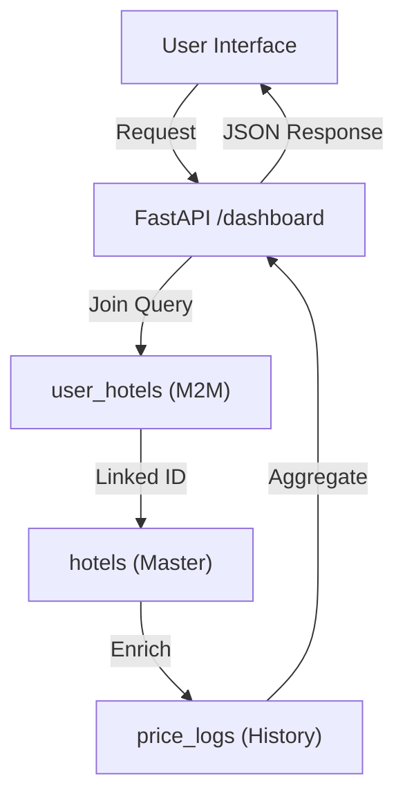

# Database Architecture: Many-to-Many Hotel Monitoring

## 1. Schema Design
The system uses a **Normalization Layer** to separate "Hotel Facts" from "User Choices."

### Core Tables
1.  **`hotels`**: The Master Property Record.
    *   `id`: Primary Key (UUID)
    *   `serp_api_id`: Unique identifier for global property mapping.
    *   `reviews`, `sentiment_breakdown`, `rating`: Global platform data.
2.  **`user_hotels`**: The Association Bridge (M2M).
    *   `user_id`: Links to auth.users.
    *   `hotel_id`: Links to target property.
    *   `is_target`: Boolean (User-specific target selection).
    *   `pricing_dna`: JSONB (User-specific pricing strategy).

## 2. How Data is Written to Users

### Scenario 1: Adding a New Hotel
When a user adds a hotel, the system follows this workflow:
1.  **Deduplication**: Checks `hotels` table for existing `serp_api_id`.
2.  **Directory Sync**: If the hotel exists, the system reuses that `id`.
3.  **Link Creation**: A new record is added to `user_hotels` for the requesting user.
4.  **Implicit Data Access**: Since the relationship is M2M, the user instantaneously gains access to all historical price logs and reviews already stored in the `hotels` and `price_logs` tables.

### Scenario 2: Selecting a Target Hotel
The **Target Selection** is governed by a database trigger (`sync_user_target_hotel`):
- **User Action**: Sends `UPDATE user_hotels SET is_target = true WHERE hotel_id = ...`.
- **Database Logic**: Intercepts the write and automatically sets `is_target = false` for all other hotels owned by that user.
- **Client Impact**: Guarantees that only ONE hotel is ever treated as the "My Hotel" source in the dashboard calculations.

## 3. Data Flow Diagram (Mermaid)

## 4. Key Security Rules (RLS)
The `user_hotels` table is protected by Row Level Security (RLS):
- **Select**: `auth.uid() = user_id`
- **Update**: `auth.uid() = user_id`
- **Delete**: `auth.uid() = user_id`

This ensures that while the `hotels` master record is platform-wide, your **Pricing DNA** and **Target Status** remain strictly private.
