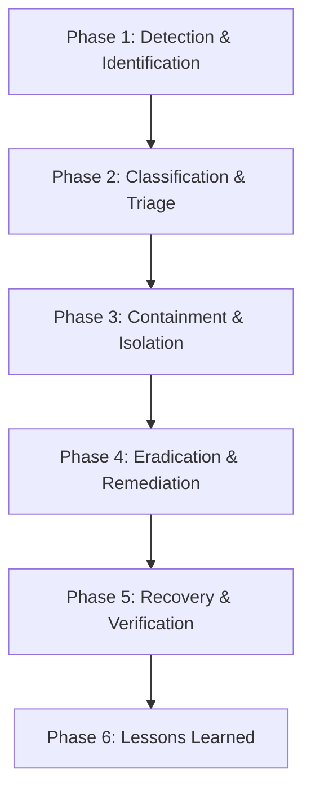

# 🚨 HotelPlus Incident Response Plan (IRP)

**Document Version:** 1.0.0  
**Effective Date:** May 30, 2026  
**Applicability:** All HotelPlus systems, employees, vendors, and contractors.  

---

## 1. Document Purpose and Scope
This **Incident Response Plan (IRP)** outlines the procedures, roles, and responsibilities for detecting, responding to, containing, and recovering from information security incidents. This plan is designed to protect HotelPlus data, B2B user data, and infrastructure, ensuring compliance with global privacy regulations (GDPR, KVKK, CCPA) and enterprise vendor security standards.

---

## 2. Incident Response Team (IRT) Roles
When an incident is declared, the **Incident Response Team (IRT)** is activated:

| Role | Responsibility |
|:---|:---|
| **Incident Commander (Lead Architect)** | Coordinates all technical investigation and containment activities. |
| **Security Engineer** | Conducts log analysis, network isolation, and eradication. |
| **Legal & Compliance Officer** | Manages external reporting, compliance review, and breach notification SLAs. |
| **Communications Lead** | Coordinates messaging to enterprise hotel customers and the public. |

---

## 3. Incident Classification Matrix

Incidents are classified based on severity and business impact:

| Severity Level | Definition | Response SLA | Target Containment |
|:---|:---|:---|:---|
| **🔴 Critical (L1)** | Active data breach of user profiles, exposure of credentials, total service outage, or unauthorized database access. | **Within 30 Mins** | < 4 Hours |
| **🟡 High (L2)** | Disruption of competitor scanning pipelines, high-volume API rate limiting failures, or localized system component compromise. | **Within 2 Hours** | < 12 Hours |
| **🔵 Medium (L3)** | Individual user account locked, non-critical database query failures, or minor dashboard visualization anomalies. | **Within 12 Hours** | < 24 Hours |
| **🟢 Low (L4)** | Typographical issues, public documentation discrepancies, or cosmetic UI bugs. | **Within 24 Hours** | Next Sprint |

---

## 4. Phase-by-Phase Incident Response Lifecycle

### Phase 1: Detection & Identification
*   **Sources:** Automated alarms (CPU peaks, DB connection spike notifications), web application firewall alerts, or user bug reports.
*   **Actions:** Enforce capture of relevant log footprints (application logs in Vercel, query history in InsForge). Preserve evidence immediately without modifying the state.

### Phase 2: Classification and Triage
*   The IRT analyzes findings to verify if an actual incident is underway, establishes the severity level, and logs it in the internal Security Incident Registry.

### Phase 3: Containment (Stop the Spread)
*   **Short-term Containment:** Rotate credentials, disable affected user accounts, or restrict incoming requests via CDN/WAF rules.
*   **Long-term Containment:** Isolate affected microservices or block specific IP ranges.

### Phase 4: Eradication & Remediation
*   Locate and eliminate the root cause (e.g., patch software vulnerabilities, deploy code updates to close logical gaps).
*   Perform full system scans to ensure no trace of malicious code or backdoor access remains.

### Phase 5: Recovery & Verification
*   Restore services from verified backups (using standard database restore runbooks).
*   Implement strict testing validation (unit tests and integration scripts) to confirm normal operation.
*   Monitor traffic closely for 72 hours post-incident.

### Phase 6: Post-Incident Review (Lessons Learned)
*   Within 5 business days of incident closure, conduct a retrospective.
*   Document what happened, why it happened, and how to prevent it in the future.
*   Publish a formal Post-Incident Report (PIR) for auditing records.

---

## 5. Breach Notification SLA & Legal Mandate
In the event of confirmed unauthorized access to user profile metadata (e.g., business emails, phone numbers, or passwords):
1.  **Notification Threshold:** HotelPlus commits to notifying affected enterprise B2B hotel administrators and regulatory bodies **within 72 hours** of breach validation, satisfying GDPR Article 33 and KVKK requirements.
2.  **Notification Content:** The breach notification must describe the nature of the breach, categories of data affected, contact details of the IRT, likely consequences, and mitigation measures taken.
