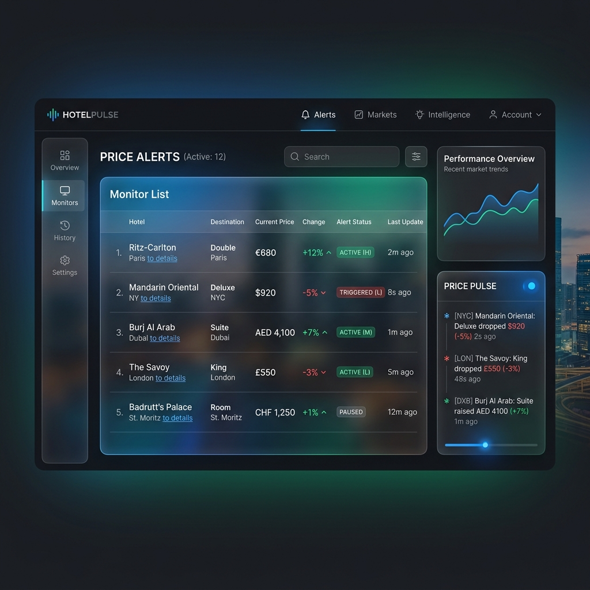

# Price Monitoring & Notification System

This document provides a technical overview of the autonomous price monitoring pipeline, detailing the workflow from background execution to user notification.

## 1. Conceptual Vision: The Data Pulse
The "Pulse" represents the heartbeat of the platform—a continuous stream of high-fidelity market data that keeps hoteliers ahead of the curve.


*Figure 1: Conceptual visualization of the real-time monitoring dashboard.*

## 2. Pipeline Orchestration

The system follows a tiered execution model to ensure reliability:

### Stage A: The Shell Trigger (`monitor_service.py`)
- **Action**: Initiated via GitHub Actions cron or manual dashboard trigger.
- **Responsibility**:
    1.  Initialize a `scan_session` in the database to track audit logs.
    2.  Identify all "Target Hotels" that require a pulse check based on user settings.
    3.  Hand off logic to the specialized `NotifierAgent`.

### Stage B: The Intelligence Layer (`NotifierAgent`)
- **Action**: Processes market data and determines parity risks.
- **Responsibility**:
    - **Price Extraction**: Utilizes a polymorphic extraction logic to pull data from both hydrated `Hotel` models and raw `metadata` payloads (see [Section 3](#3-robust-price-extraction-fix)).
    - **Comparison**: Benchmarks the current hotel price against its competitors.
    - **State Management**: Logs the result to the `price_logs` table.

## 3. Robust Price Extraction Fix

A critical bug was identified where the `NotifierAgent` failed to process results from "Manual Scans" due to a mismatch in data structures. The agent now implements a robust extraction strategy:

```python
# Updated robust extraction logic in NotifierAgent
price = None
if hasattr(result, 'price_info') and result.price_info:
    # Direct Hotel model from search
    price = result.price_info.get('current_price')
elif isinstance(result, dict) and 'metadata' in result:
    # Manual scan payload from session results
    price = result['metadata'].get('current_price')
```

This fix ensures that whether a scan is automated or triggered by a user, the system consistently captures and logs the price data.

## 4. Database Schema & Tracking

### `price_logs`
Stores time-series price data for all tracked hotels.
- `hotel_id`: Reference to master property.
- `price`: Floating point current rate.
- `recorded_at`: Timestamp of the scan.

### `scan_sessions`
Provides an audit trail for every monitoring cycle.
- `status`: tracks `pending`, `processing`, or `completed`.
- `results`: JSONB storage of the final intelligence report.

---
*Document Version 1.1 - April 2026*
