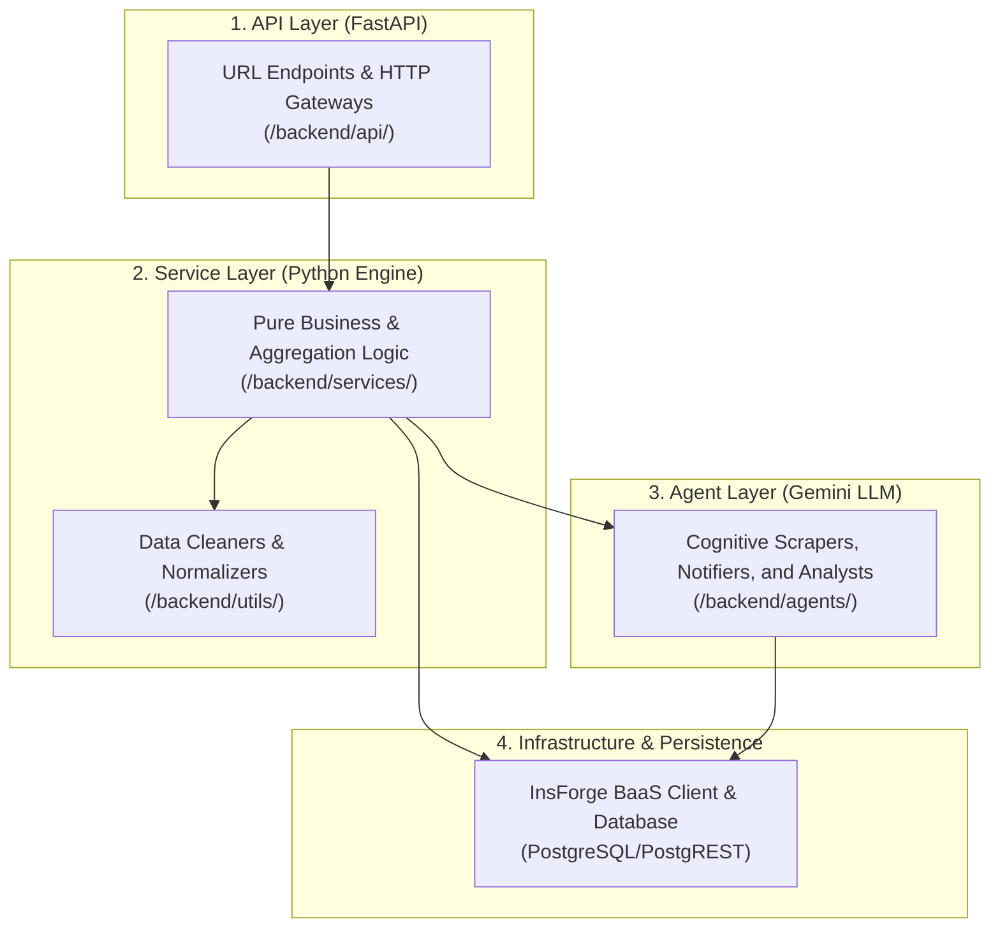

# HotelPlus: Core Modules Reference Report 🏨📊

This report provides an exhaustive structural reference of the HotelPlus platform’s modules, their discrete functions, critical engineering rules, and operational workflows.

---

## 📐 1. Three-Layer Modular Architecture Overview

HotelPlus operates on a strict, decoupled 3-layer architecture ensuring separation of concerns, horizontal scalability, and unified data access patterns.

---

## 🚀 2. API Layer (`backend/api/`)

The **API Router Layer** contains FastAPI route definitions. These modules are strictly responsible for HTTP ingress/egress, validation via Pydantic models, routing, and basic session authorization.

### 📋 Modules Reference Table

| Module / Route File | Functional Responsibility | Key Functions | Critical Rules & Constraints |
|:---|:---|:---|:---|
| [dashboard_routes.py](file:///home/tripzydevops/hotel/backend/api/dashboard_routes.py) | Entrypoint for the primary dashboard client interface. | `GET /dashboard/{user_id}` | **Strict Limit**: Must fetch ALL initialization data in parallel (alerts, active searches, target hotel, competitors) using `dashboard_service`. |
| [hotels_routes.py](file:///home/tripzydevops/hotel/backend/api/hotel_routes.py) | Handles administrative & operational Hotel CRUD operations. | `GET /`, `POST /`, `DELETE /{id}` | **Constraint**: Directly creating a hotel must trigger metadata verification to ensure accurate DataForSEO target association. |
| [scans.py](file:///home/tripzydevops/hotel/backend/api/scans.py) | Manages trigger mechanisms for on-demand or debug scans. | `POST /trigger`, `GET /status/{id}` | **Rule**: Never execute scans synchronously. Must dispatch task to `monitor_service` queue and return immediately. |
| [webhook_routes.py](file:///home/tripzydevops/hotel/backend/api/webhook_routes.py) | Validates and ingests asynchronous postbacks from external providers. | `POST /webhook/dataforseo` | **CRITICAL**: Must fetch `task_type` from database using the external `task_id` before parsing (Blind Ingest Prevention). |
| [analysis_routes.py](file:///home/tripzydevops/hotel/backend/api/analysis_routes.py) | Exposes analytical intelligence, competitor discovery, and narratives. | `GET /parity-breach`, `GET /narrative` | Requires caching or rapid Gemini API calls to ensure UI responsive times (<2s latency targets). |
| [reports_routes.py](file:///home/tripzydevops/hotel/backend/api/reports_routes.py) | Assembles long-form market reports and predictive trend aggregations. | `GET /historical-trends` | Heavily leverages aggregated time-series rollups to prevent costly massive DB joins. |

---

## ⚙️ 3. Service Layer (`backend/services/`)

The **Service Layer** encapsulates pure business logic, computing aggregations, resolving cross-cutting concerns, and interacting directly with persistence clients.

### 🔍 Core Engine Services

#### ⚡ A. `dashboard_service.py`
> The orchestrator of the master dashboard payload. Extremely performance-critical.

*   **Functional Description**: Assembles profile settings, active scan histories, hotel entities, and current price comparisons in unified payload batches.
*   **Operational Workflow**:
    1.  **Phase 1**: Executes an `asyncio.gather` to concurrent-query user preferences, current active alerts, targets, and competitors.
    2.  **Phase 2 (Enrichment Loop)**:
        *   Aggregates price trends using a hybrid pipeline: `_fetch_trend_live()` retrieves recent raw records (last 7 days) from `price_logs`, while `_fetch_trend_historical()` retrieves historical daily rollups from `price_history_daily`.
        *   Runs dynamic parity scoring (`price_comparator.py`).
        *   Fetches platform-specific reviews (`other_sites_reviews`) and performs dynamic rating scale normalization.
*   **Engine Rules**:
    *   **Authoritative Currency Resolution**: If a specific price has no explicit currency, cascade priority down to: `price_info.currency` ➔ `hotels.currency` ➔ `user_hotels.preferred_currency` ➔ default `"TRY"`.
    *   **Zero Null Fallbacks**: Missing UI items must yield structured default models rather than bare `None` types to safeguard frontend rendering.

#### 💾 B. `scan_persistence.py`
> The Write-Path Controller. Responsible for safely committing massive scrape results into SQL tables.

*   **Functional Description**: Ingests raw JSON dumps from API webhooks, normalizes payloads, and writes to `hotels`, `price_logs`, and `room_type_catalog`.
*   **Internal Subroutines**:
    *   `persist_hotel_info_result()`: Flattens DataForSEO platform reviews and saves them in bulk to `other_sites_reviews`.
    *   `persist_price_search_result()`: Processes transactional pricing entries for the time-series logs.
*   **Core Constraints**:
    *   **Deduplication Contract**: Room types from the same external vendor MUST use the composite signature: `"{vendor_source}_{room_title}_{price_value}"`. This ensures standard double rooms aren't erroneously collapsed with deluxe suites.

#### 🤖 C. `monitor_service.py`
> The Automation Dispatcher & Cron Controller.

*   **Functional Description**: Dispatches scheduled hourly (`price_search`) and daily (`hotel_info`) scans, handles timeouts, and attempts recovery on failed webhooks.
*   **Key Safeguards**:
    *   **Singleton Execution Rule**: Only a single instance of the monitoring thread may execute. Multiple instances will generate race conditions and exhaust API quotas.
    *   **Self-Healing Mechanism**: Periodically polls for `submitted` tasks older than 1 hour, pulling the results manually from the provider's fallback GET endpoint.

#### 💱 D. `config_service.py` & Sub-Helpers (Exchange Rates)
> The Platform Exchange Pipeline.

*   **Functional Description**: Manages multi-currency conversion dynamically with rigid local disk persistence.
*   **Algorithm Flow**:
    *   Retrieves USD rates from `https://open.er-api.com/v6/latest/USD` with a 4-hour TTL.
    *   Caches JSON to disk (`backend/utils/exchange_rates_cache.json`).
    *   Implements robust recovery: On remote network failures, automatically yields the local disk cache or the static baseline hardcode, logging an alert but never aborting.
    *   Supports local Turkish Lira (`TL` / `TRY`) aliasing automatically.

---

## 🧠 4. Agent Layer (`backend/agents/`)

The **Agent Layer** hosts intelligent, cognitive assistants utilizing Gemini LLMs. They extract underlying context from text, generate natural language narratives, and autonomously analyze market positions.

| Agent Module | Purpose / Autonomous Task | Context & Processing Rules |
|:---|:---|:---|
| `analyst_agent.py` | Uncovers semantic similarities between hotels using embeddings to locate hidden "ghost" competitors. | **Rule**: Competitor discovery must enforce hard geographic restrictions. Coordinates or exact `target_city` values must be supplied to the backend `match_hotels` RPC to avoid "semantic leakage" between distant cities. |
| `scraper_agent.py` | Post-processes difficult, unstructured hotel data elements and amenities, converting them into standard platform signatures. | Leverages regex patterns alongside LLM logic to extract granular information without expensive model invocations where possible. |
| `demand_agent.py` | Inspects city-wide inventory, external market signals, and global events to compute daily demand fluctuations. | Must output highly formatted numerical weights utilized by the Predictive Service pipeline. |
| `notifier_agent.py` | Formulates crisp, readable SMS/email/in-app copy summarizing recent parity breaches and actionable pricing recommendations. | Generates dynamic text snippets emphasizing the exact monetary saving or violation loss percentage. |

---

## 🛠️ 5. Utilities & Transformations (`backend/utils/`)

Highly reusable helper files tasked with string sanitization, normalization, math routines, and direct database wrapper initialization.

### 🧩 Vital Utility Modules

*   **`room_normalizer.py`**: Normalizes highly fragmented room naming schemas (e.g., `"STD DBL KNG ROOM"` ➔ `"Standard Double King Room"`). Ensures accurate aggregations in time-series analysis.
*   **`vendor_normalizer.py`**: Resolves messy third-party identifiers into authoritative OTA channels (e.g., `"Bkng"`, `"Booking COM"` ➔ `"Booking.com"`).
*   **`sentiment_utils.py`**: Parses and extracts core qualitative reviews. Classifies reviews into sentiment dimensions (e.g., Cleanliness, Service, Value) and scores them on unified matrices.
*   **`embeddings.py`**: Connects to Gemini Embedding engines. Performs dimension-slicing (adjusting 3072 dims to DB-compatible 768 vector index ranges).
*   **`db.py`**: Master connection pool initializer for InsForge PostgREST client interfaces.

---

## 📊 6. Core Database Layer Contracts (InsForge PostgreSQL)

For full table definitions and schemas, refer to [ProjectArchitecture.md](file:///home/tripzydevops/hotel/ProjectArchitecture.md). Key relational rules include:

1.  **`hotels`**: Contains the primary, authoritative data. Soft deletes are mandatory via `deleted_at`.
2.  **`price_logs`**: An append-only timeseries repository. NEVER edit a log entry once stored.
3.  **`room_type_catalog`**: Synchronized inventory directory. Serves as standard index mapping for pricing comparisons.

> [!WARNING]
> **Retention Flow Restriction**: Migration `039` enforces that daily price rollup triggers verify that `room_types` is explicitly a JSON array (`jsonb_typeof(room_types) = 'array'`) before calling length aggregators. Ensure custom SQL rollups mirror this protective verification to prevent silent transaction aborts.

---

## 🛡️ 7. Engineering Rules of Stability

To safeguard production uptime, developers and agents MUST strictly abide by the following operational guidelines:

*   🚫 **Unstable Code Prohibition**: No experimental libraries allowed. Next.js, React, and Tailwind versions are strictly pinned.
*   🔒 **Direct Scrape Mapping**: Always fetch nested `offers` objects during `hotel_info` data harvesting. Refuse flat provider pricing to ensure granular data richness.
*   ⚙️ **Exception Scrubbing**: Never allow raw tracebacks to bypass the server interface. All unexpected faults must pass through the `global_exception_handler` for standard diagnostic formatting.

---

## 🔒 8. In-Function Protections & Global Safeguards

The Python backend functions and API layers enforce robust programmatic guards to guarantee security boundaries, state integrity, and cost containment.

### 👮 A. Authorization & Ownership Security Guard (`verify_ownership`)
Located in `backend/utils/security.py`.
*   **Operational Restriction**: Before execution of any mutation or retrieval inside CRUD endpoints, the module must invoke `verify_ownership(resource_user_id, current_user)`.
*   **Protection Level**:
    *   **Tenant Isolation**: Ensures users cannot harvest data or manipulate profiles of other hotels by matching their active session ID with target IDs.
    *   **Explicit Admin Override**: Features an embedded admin bypass that inspects metadata roles (`admin`, `market_admin`) to enable specialized overrides exclusively for management accounts.
    *   **Standardized Lockout**: Any failure raises a direct, unmaskable `HTTPException(status_code=403, detail="Forbidden: Resource ownership mismatch")`.

### 🩹 B. The Global Exception Scrubbing Filter (`global_exception_handler`)
Located in `backend/main.py`.
*   **Rule**: All unhandled server-side errors (`HTTPException >= 500` or general `Exception`) generated anywhere in the functional stack are intercepted by a centralized Pydantic-friendly decorator.
*   **Protection**: Sanitizes the payload by stripping raw stack traces, database engine configurations, or directory path leaks and returning a rigid, static message: `{"detail": "Internal Server Error"}`.

### 💸 C. The "Token-First" Cost Safeguard (Sentinel Monitoring)
Located in scheduled scheduler loops and `monitor_service.py`.
*   **Operational Rule**: The execution pipeline strictly bypasses automatic scanning for any hotel lacking either a `property_token` or a `serp_api_id`.
*   **Protection**: Defuses wildcard scans that consume excessive API credits on low-quality search attempts, protecting infrastructure budgets.

### 🛡️ D. Dynamic Multi-Tiered Circuit Breakers (Exchange Rate API)
Located in currency conversions (`config_service.py`).
*   **Mechanism**: Currency conversion logic enforces a strict 4-tier cascade: API Request ➔ Local Disk Cache ➔ Memory Resident Cache ➔ Static Baseline hardcode (`TRY`/`TL: 0.029`, `EUR: 1.08`, etc.).
*   **Protection**: Guarantees math routines never receive `None` values, preventing catastrophic cascading server errors during temporary upstream network disruptions.

### 🖇️ E. Composite Hashing Deduplication Constraint
Located in standard ingest loops (`scan_persistence.py`).
*   **Constraint**: Prevents duplicate catalog entry explosions by requiring room items from vendors to pass a combined composite key signature verification: `"{vendor_source}_{room_title}_{price_value}"`.
*   **Protection**: Blocks parallel incoming webhook records from inflating time-series aggregates or skewing average price reporting.

### 💽 F. JSONB Array In-Trigger Schema Guard (Database Stored Procedures)
Located at the Postgres Trigger level (Migration `039`).
*   **Rule**: Stored procedures processing pricing arrays must execute an in-function type validation: `jsonb_typeof(room_types) = 'array'`.
*   **Protection**: Prevents stored procedures from crashing the entire ingestion transaction if a malformed JSON block is transmitted.

---

*Report generated and authorized by Antigravity.* 🚀
