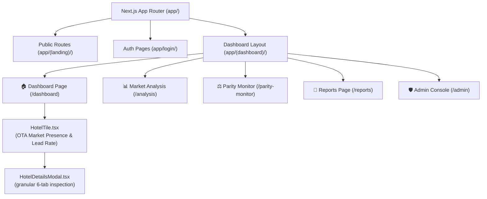
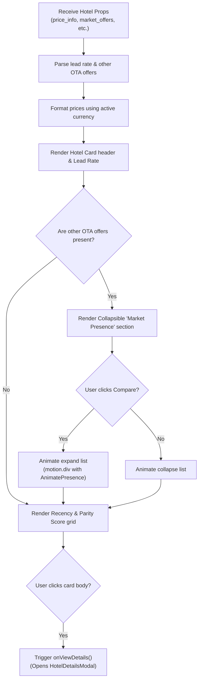

# Frontend Functionality Guide: Hotel Rate Sentinel (HotelPlus) 🏨🚀

Welcome to the comprehensive frontend functionality guide for **HotelPlus**. This guide serves as the definitive documentation for all user interface modules, custom visual components, and frontend-to-backend interaction pipelines.

---

## 🗺️ Next.js Route & Component Blueprint
The HotelPlus application leverages the **Next.js App Router** with a modular, 3-layer architecture. Below is the interactive visual flow representing how client-side page views relate to custom visual components:

---

## 1. 🏠 Dashboard Module
**Path:** [app/(dashboard)/dashboard/page.tsx](file:///home/tripzydevops/hotel/app/(dashboard)/dashboard/page.tsx)  
The central command center designed for rapid market scanning and parity diagnostics.

- **KPI Stats Summary**: Displays high-level real-time aggregates like *Average Price*, *Parity Score*, and *Active Parity Alerts*.
- **Hotel Selector**: Allows instant swapping of the active property to render corresponding competitive sets.
- **Quick Scans**: Trigger manual, on-demand scans that communicate directly with FastAPI background workers.

---

## 🏨 Feature Spotlight: Hotel Cards & OTA Market Presence

The hotel list is built dynamically using the premium [HotelTile.tsx](file:///home/tripzydevops/hotel/components/tiles/HotelTile.tsx) component. This card component is specially engineered to provide an immediate **at-a-glance** representation of market competitive rates.

### Core Visual Features of `HotelTile`
1. **Lead Rate / Primary Offer Display**: 
   - Prominently showcases the lowest live rate found during the latest DataForSEO scan (lead price).
   - Formatted in the user's preferred currency (resolved via the active `ExchangeRateCache` subsystem).
2. **Dynamic OTA Market Presence Collapse**:
   - If a hotel possesses multiple OTA offers, a custom collapsible comparison list is rendered.
   - Users can toggle the **Compare / Expand** trigger to expand or collapse additional OTA offers side-by-side.
3. **Smooth Micro-Animations**:
   - Leverages **Framer Motion's** `<AnimatePresence>` and `<motion.div>` for buttery-smooth expansion transitions.
   - Offers dynamic hover-state animations to indicate interactive parity metrics.
4. **Parity Rating & Recency Grid**:
   - Renders the calculated Parity Score alongside the recency timestamp of the latest scan.

### Component Render & State Flow:

---

## 📑 Feature Spotlight: Granular Inspection Popup

Clicking any hotel card on the dashboard triggers the premium [HotelDetailsModal.tsx](file:///home/tripzydevops/hotel/components/modals/HotelDetailsModal.tsx) component. This component houses a high-fidelity, **6-tab granular analysis interface**:

| Tab Name | Visual Content / Metrics | Business Value |
|---|---|---|
| **Overview** | General hotel metadata, rating aggregates, address, and live map preview. | Fast visual confirmation of property identity. |
| **Gallery** | Fully animated high-res image grid with lightboxes. | Direct visual inspection of the property asset. |
| **Amenities** | Semantic categorical grouping of verified property amenities. | Competitor amenity gap analysis. |
| **Offers** | Full live listing of parsed room offers with bed types, refund policies, and OTA labels. | Direct rate-matching and offer parity audits. |
| **Rooms** | Catalog of normalized room types with semantic pricing baselines. | Standardizing room categories against competitors. |
| **Reviews** | Normalized reviews across Booking.com, Tripadvisor, and Google with emotional connotations. | Cross-platform sentiment analysis. |

---

## 2. 📊 Market Analysis Module
**Path:** [app/(dashboard)/analysis/page.tsx](file:///home/tripzydevops/hotel/app/(dashboard)/analysis/page.tsx)  
Deep business intelligence utility powered by Recharts visualizations.

- **Rate Heatmap Calendar**: Multi-dimensional view displaying direct vs. competitive pricing for future check-in dates.
- **AI Competitor Discovery**: Vector-similarity utility using property feature embeddings to find hidden market threats.
- **Unified Sentiment Pulse**: Charts guest sentiment patterns categorized by Cleanliness, Service, and Location across third-party channels.

---

## 3. ⚖️ Parity Monitor
**Path:** [app/(dashboard)/parity-monitor/page.tsx](file:///home/tripzydevops/hotel/app/(dashboard)/parity-monitor/page.tsx)  
Dedicated compliance console to prevent third-party OTA price undercutting.

- **Channel Price Spread**: Live comparison grid showing direct rate vs. live Booking.com, Expedia, and Trip.com rates.
- **Parity Deficit Highlighter**: Visual indicators identifying dates where third parties violate direct booking agreements.

---

## 4. 📑 Exportable Reports
**Path:** [app/(dashboard)/reports/page.tsx](file:///home/tripzydevops/hotel/app/(dashboard)/reports/page.tsx)  
Generates publication-ready metrics for hotel stakeholders.

- **PDF/CSV Generators**: Formulates formatted pricing histories, competitor rate variance logs, and parity violation occurrences.
- **Automated Pulse Schedulers**: Configures cron-driven reports delivered directly to executive mailboxes.

---

## 5. 🛡️ Admin & System Health Console
**Path:** [app/(dashboard)/admin/page.tsx](file:///home/tripzydevops/hotel/app/(dashboard)/admin/page.tsx)  
Control station for database syncing and provider quota management.

- **Directory Synchronization**: Manually push local database attributes to enrich the global property index.
- **Live Provider Quotas**: Displays up-to-the-second API utilization statistics for DataForSEO and SerpApi engines.
- **Real-Time Logs**: View background continuous monitor streams and exceptions handled by `global_exception_handler`.

---
*Last Updated: April 2026 | Document Owner: AI Engineering Group*
